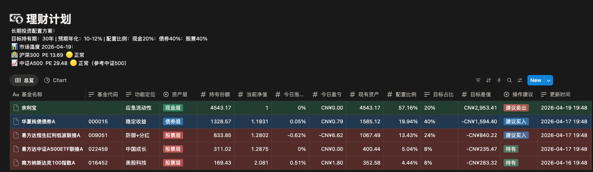

# 基金组合监控 · Fund Monitor

> 基于天天基金公开接口，每日自动同步基金净值与再平衡建议到 Notion，附 A 股市场估值温度。

---

## 预览



---

## 项目介绍

个人基金组合的自动化监控工具。持有的基金每天收盘后净值自动更新到 Notion 数据库，同时根据目标配置比例计算偏离情况，给出买入 / 卖出 / 持有建议。无需手动查询，无需手动计算，打开 Notion 一眼看完。

---

## 投资策略说明

本项目基于**固定比例再平衡**策略，将资产分为三层：

| 资产层 | 说明 | 示例 |
|--------|------|------|
| 现金层 | 流动性储备，随时可用 | 余利宝、货币基金 |
| 债券层 | 稳定收益，低波动 | 纯债基金 |
| 股票层 | 长期增值，承受波动 | 指数基金、ETF |

**核心思路：**

1. **设定目标比例** — 根据自身风险承受能力，为每只基金设定目标占比（如现金 20%、债券 40%、股票 40%），填入 Notion 的「目标占比」字段
2. **每日自动监控** — 脚本每天计算各基金实际占比与目标的偏差（「目标差值」= 实际市值 − 目标市值）
3. **偏离触发提醒** — 某只基金偏离目标超过 **5%** 时，自动标记「建议买入」或「建议卖出」
4. **手动执行调仓** — 收到提醒后，按「目标差值」的金额买入或卖出对应基金，将比例拉回目标

**为什么要再平衡？**

市场涨跌会使各资产的实际占比逐渐偏离初始设定。定期再平衡的本质是「高卖低买」——股票涨多了就卖掉一些补到债券，债券跌了就用现金补进来，长期下来有助于控制风险并改善收益。

---

## 主要特点

- **自动更新净值** — 每个工作日晚上 8 点通过 GitHub Actions 自动运行，拉取天天基金最新确认净值（T+1）
- **实时配置比例** — 自动计算每只基金的实际持仓占比，与目标占比对比
- **再平衡提醒** — 偏离目标超过 5%（可配置）时，标记「建议买入」或「建议卖出」并显示调仓金额
- **市场估值温度** — 每日抓取沪深 300、中证 A500（参考中证 500）PE 值，低估 🟢 / 正常 🟡 / 高估 🔴
- **完全 Notion 集成** — 净值、涨跌幅、盈亏、建议均写入 Notion 数据库，支持表格和饼图视图
- **零运维** — GitHub Actions 免费定时任务，无需服务器

---

## 技术栈

| 层次 | 技术 |
|------|------|
| 数据源 | 天天基金（东方财富）公开 API |
| 指数估值 | akshare（乌龟量化数据） |
| 数据存储展示 | Notion Database API |
| 自动化调度 | GitHub Actions（每工作日 20:00 CST） |
| 运行环境 | Python 3.11 |

---

## Notion 数据库字段说明

| 字段 | 类型 | 说明 |
|------|------|------|
| 基金名称 | 标题 | 基金名称 |
| 基金代码 | 文本 | 天天基金代码（空=货币基金如余利宝） |
| 资产层 | 选择 | 现金层 / 债券层 / 股票层 |
| 持有份额 | 数字 | **手动填写**，交易后更新 |
| 当前净值 | 数字 | 自动更新 |
| 今日涨跌幅 | 百分比 | 自动更新 |
| 今日盈亏 | 元 | 自动更新 |
| 现有资产 | 数字 | 自动更新（净值 × 份额） |
| 配置比例 | 百分比 | 自动更新（当前市值 / 总市值） |
| 目标占比 | 文本 | 手动填写，如 `40%` |
| 目标差值 | 元 | 自动更新（正值=超配，负值=低配） |
| 操作建议 | 选择 | 自动更新：持有 / 建议买入 / 建议卖出 |
| 更新时间 | 文本 | 自动更新 |

---

## 使用方法

### 1. 准备 Notion

1. 在 [notion.so/my-integrations](https://www.notion.so/my-integrations) 创建一个内部集成，复制 Token（`ntn_xxx` 或 `secret_xxx`）
2. 打开你的 Notion 数据库页面，点击右上角 `...` → `连接` → 选择刚创建的集成
3. 在数据库中填写每只基金的**持有份额**和**目标占比**

### 2. 本地运行

```bash
git clone https://github.com/guoyingwei6/fund-monitor.git
cd fund-monitor
pip install -r requirements.txt

export NOTION_TOKEN=你的token
python fund_monitor.py
```

### 3. GitHub Actions 自动运行

1. Fork 或 push 到你自己的 GitHub 仓库
2. 进入仓库 **Settings → Secrets and variables → Actions**
3. 添加 Secret：`NOTION_TOKEN` = 你的 Notion Token
4. 之后每个工作日晚上 8 点自动运行，也可在 Actions 页面手动触发

### 4. 可选配置

在 GitHub Actions 的 workflow 文件或本地环境变量中设置：

```bash
# 再平衡触发阈值，默认 5%（偏离超过此值才提示调仓）
export REBALANCE_THRESHOLD=0.05
```

---

## 数据来源说明

| 数据 | 来源 | 说明 |
|------|------|------|
| 基金净值 | 天天基金（东方财富）API | 每日收盘后约 18:00 更新，T+1 确认净值 |
| 沪深 300 PE | akshare / 乌龟量化 | 滚动市盈率（TTM） |
| 中证 A500 PE | akshare / 乌龟量化 | 以中证 500 PE 作参考 |
| 恒生、纳斯达克 | 暂无免费接口 | 不支持 |

> 所有数据均来自公开接口，无需注册或付费。

---

## 版本更新日志

### v1.3.0 · 2026-04-20
- 新增：沪深300 PB（市净率）指标，PE+PB 双维度估值
- 新增：10年期国债收益率 + 股债利差，判断股票相对债券的性价比
- 新增：综合买卖建议，三项指标加权评分后给出操作方向
- 参考范围：PE<12🟢 12-18🟡 >18🔴 ｜ PB<1.2🟢 1.2-1.8🟡 >1.8🔴 ｜ 利差>5%🟢 2-5%🟡 <2%🔴

### v1.2.0 · 2026-04-19
- 新增：沪深 300 / 中证 A500 市场估值温度，写入 Notion 描述区
- 新增：PE 信号分级（🟢 低估 / 🟡 正常 / 🔴 高估）

### v1.1.0 · 2026-04-19
- 新增：配置比例由脚本直接计算写入，移除对第二个数据库的依赖
- 优化：余利宝等无代码基金正确写入再平衡字段
- 删除：冗余的「调仓金额」字段（与「目标差值」重复）
- 删除：「资产汇总」数据库（合并逻辑到脚本）

### v1.0.0 · 2026-04-19
- 初始版本：天天基金净值自动更新到 Notion
- 支持：持有份额 × 净值 = 现有资产，自动计算
- 支持：再平衡建议（买入 / 卖出 / 持有）
- 支持：GitHub Actions 每工作日定时运行
