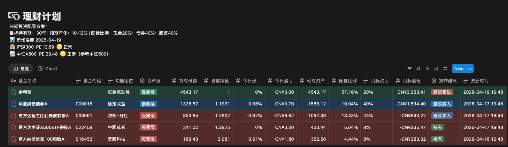

# 基金组合监控 · Fund Monitor

> 基于天天基金公开接口，每日自动同步基金净值与再平衡建议到 Notion，附 A 股市场估值温度。

---

## 预览



---

## 项目介绍

个人基金组合的自动化监控工具。持有的基金每天收盘后净值自动更新到 Notion 数据库，同时根据目标配置比例计算偏离情况，给出买入 / 卖出 / 持有建议。无需手动查询，无需手动计算，打开 Notion 一眼看完。

如果需要让 Codex 进一步解释基金理财知识、结合知识库做组合复盘、制定定投或再平衡执行计划，请参考 [Codex Finance Assistant](docs/codex-finance-assistant.md)。

---

## 投资策略说明

本项目基于**固定比例再平衡**策略，将资产分为两层：

| 资产层 | 说明 | 示例 |
|--------|------|------|
| 债券层 | 稳定收益，低波动 | 纯债基金 |
| 股票层 | 长期增值，承受波动 | 指数基金、ETF |

**核心思路：**

1. **设定目标比例** — 根据自身风险承受能力，为每只基金设定目标占比（如债券 40%、股票 60%），填入 Notion 的「目标占比」字段
2. **每日自动监控** — 脚本每天计算各基金实际占比与目标的偏差（「目标差值」= 实际市值 − 目标市值）
3. **偏离触发提醒** — 某只基金偏离目标超过 **5%** 时，自动标记「建议买入」或「建议卖出」
4. **手动执行调仓** — 收到提醒后，按「目标差值」的金额买入或卖出对应基金，将比例拉回目标

**为什么要再平衡？**

市场涨跌会使各资产的实际占比逐渐偏离初始设定。定期再平衡的本质是「高卖低买」——股票涨多了就卖掉一些补到债券，债券涨多了就卖掉一些补到股票，长期下来有助于控制风险并改善收益。

---

## 主要特点

- **自动更新净值** — 每个工作日晚上 7 点通过 GitHub Actions 自动运行，拉取天天基金最新确认净值（T+1）
- **实时配置比例** — 自动计算每只基金的实际持仓占比，与目标占比对比
- **再平衡提醒** — 偏离目标超过 5%（可配置）时，标记「建议买入」或「建议卖出」并显示调仓金额
- **市场估值温度** — 每日抓取沪深 300、中证 A500（参考中证 500）PE 值，低估 🟢 / 正常 🟡 / 高估 🔴
- **策略说明保留** — 自动维护 Notion 数据库描述区和父页面正文的长期配置说明，并在下方刷新市场温度
- **完全 Notion 集成** — 净值、涨跌幅、盈亏、建议均写入 Notion 数据库，支持表格和饼图视图
- **交易流水记录** — 支持把支付宝基金截图 OCR 文本写入 Notion「交易流水」，为后续 XIRR 年化收益率计算保留现金流
- **截图导入去重** — 买入 / 卖出记录优先按订单号去重；待确认记录确认后会更新原记录，已确认记录重复导入会跳过
- **零运维** — GitHub Actions 免费定时任务，无需服务器

---

## 技术栈

| 层次 | 技术 |
|------|------|
| 数据源 | 天天基金（东方财富）公开 API |
| 指数估值 | akshare（乌龟量化数据） |
| 数据存储展示 | Notion Database API |
| 自动化调度 | GitHub Actions（每工作日 19:00 CST） |
| 运行环境 | Python 3.11 |

---

## Notion 数据库字段说明

### 基金持仓

| 字段 | 类型 | 说明 |
|------|------|------|
| 基金名称 | 标题 | 基金名称 |
| 基金代码 | 文本 | 天天基金代码 |
| 资产层 | 选择 | 债券层 / 股票层 |
| 持有份额 | 数字 | **手动填写**，交易后更新 |
| 当前净值 | 数字 | 自动更新 |
| 今日涨跌幅 | 百分比 | 自动更新 |
| 今日盈亏 | 公式 | 自动计算（现有资产 × 今日涨跌幅） |
| 现有资产 | 公式 | 自动计算（持有份额 × 当前净值） |
| 配置比例 | 百分比 | 自动更新（当前市值 / 总市值） |
| 目标占比 | 文本 | 手动填写，如 `40%` |
| 目标差值 | 元 | 自动更新（正值=超配，负值=低配） |
| 操作建议 | 选择 | 自动更新：持有 / 建议买入 / 建议卖出 |
| 估值信号 | 选择 | 自动更新：低估 / 正常 / 高估 / 暂无 |
| 定投建议 | 选择 | 自动更新：暂停 / 50% / 100% / 150% / 200% |
| 更新时间 | 文本 | 自动更新 |

### 交易流水

交易流水用于记录买入、卖出、分红、份额调整和持仓快照。它不是当前持仓状态表，而是后续计算真实年化收益率（XIRR）的现金流与审计记录。

| 字段 | 类型 | 说明 |
|------|------|------|
| 交易名称 | 标题 | 自动生成，如 `2026-06-08 南方纳斯达克100指数A 买入` |
| 日期 | 日期 | 买入 / 卖出 / 截图记录日期 |
| 基金 | 关联 | 关联到「基金持仓」中的对应基金 |
| 类型 | 选择 | 买入 / 卖出 / 分红 / 份额调整 / 持仓快照 |
| 状态 | 选择 | 已确认 / 待确认 / 已同步 |
| 金额 | 数字 | 买入为负数，卖出 / 分红为正数，持仓快照为 0 |
| 份额变动 | 数字 | 买入确认份额为正，卖出份额为负 |
| 持有份额快照 | 数字 | 资产详情截图中的当前持有份额 |
| 确认净值 | 数字 | 交易确认净值或截图中的基金净值 |
| 确认金额 | 数字 | 交易确认金额 |
| 手续费 | 数字 | 交易手续费 |
| 确认日期 | 日期 | 基金确认日期 |
| 订单号 | 文本 | 支付宝交易订单号，用于去重 |
| 来源 | 选择 | 如 支付宝截图 |
| 去重键 | 文本 | 脚本生成，用于防止重复导入 |
| OCR原文 | 文本 | 原始 OCR 文本，便于排查解析问题 |

---

## 使用方法

### 1. 准备 Notion

1. 在 [notion.so/my-integrations](https://www.notion.so/my-integrations) 创建一个内部集成，复制 Token（`ntn_xxx` 或 `secret_xxx`）
2. 打开你的 Notion 数据库页面，点击右上角 `...` → `连接` → 选择刚创建的集成
3. 在数据库中填写每只基金的**持有份额**和**目标占比**

### 2. 本地运行

```bash
git clone https://github.com/guoyingwei6/fund-monitor.git
cd fund-monitor
pip install -r requirements.txt

export NOTION_TOKEN=你的token
python fund_monitor.py
```

### 3. GitHub Actions 自动运行

1. Fork 或 push 到你自己的 GitHub 仓库
2. 进入仓库 **Settings → Secrets and variables → Actions**
3. 添加 Secret：`NOTION_TOKEN` = 你的 Notion Token
4. 之后每个工作日晚上 7 点自动运行，也可在 Actions 页面手动触发

### 4. 可选配置

在 GitHub Actions 的 workflow 文件或本地环境变量中设置：

```bash
# 再平衡触发阈值，默认 5%（偏离超过此值才提示调仓）
export REBALANCE_THRESHOLD=0.05
```

定投建议不会改变长期目标占比，只用于调节新增资金。执行优先级是先看「操作建议」，再看「估值信号」：

| 操作建议 | 估值信号 | 定投建议 |
|----------|----------|----------|
| 建议卖出 | 任意 | 暂停 |
| 建议买入 | 低估 | 200% |
| 建议买入 | 正常 / 暂无 | 150% |
| 建议买入 | 高估 | 50% |
| 持有 | 低估 | 150% |
| 持有 | 正常 / 暂无 | 100% |
| 持有 | 高估 | 50% |

### 5. 记录支付宝截图交易

项目提供 `record_trade_from_ocr.py` 和 GitHub Actions workflow `record_trade.yml`，用于把支付宝基金截图 OCR 文本写入 Notion「交易流水」。

支持两类截图：

1. **交易详情截图**：包含买入金额、确认份额、确认净值、手续费、订单号等字段，会记录为真实现金流，用于后续 XIRR 计算。
2. **资产详情截图**：包含持有金额、持有份额、基金净值、持有收益等字段，会记录为「持仓快照」，不作为真实买入 / 卖出现金流。

如果同一订单号已经存在，脚本会按状态处理：

- 旧记录是 `待确认`，新截图是 `已确认`：更新原交易记录，补齐确认金额、确认份额、确认净值、手续费和确认日期，并更新持仓份额
- 旧记录已经是 `已确认`：跳过，避免重复记录和重复加份额

本地测试：

```bash
export NOTION_TOKEN=你的token
export NOTION_DATABASE_ID=基金持仓数据库ID
export NOTION_TRADES_DATABASE_ID=交易流水数据库ID

# 先只解析，不写入 Notion
python record_trade_from_ocr.py --ocr-file ocr.txt --dry-run

# 写入交易流水，并在适合时更新基金持仓份额
python record_trade_from_ocr.py --ocr-file ocr.txt

# 导入历史截图时，只写交易流水，不更新当前持仓份额
python record_trade_from_ocr.py --ocr-file ocr.txt --no-update-holdings
```

手机快捷指令流程：

1. 截取支付宝基金详情或交易详情页面
2. 用 iOS 快捷指令「从图像中提取文本」
3. 将 OCR 文本通过 GitHub API 触发 `record_trade.yml`
4. GitHub Actions 调用脚本解析文本并写入 Notion

---

## 数据来源说明

| 数据 | 来源 | 说明 |
|------|------|------|
| 基金净值 | 天天基金（东方财富）API | 每日收盘后约 18:00 更新，T+1 确认净值 |
| 沪深 300 PE | akshare / 乌龟量化 | 滚动市盈率（TTM） |
| 中证 A500 PE/PB | akshare / 乌龟量化 | 暂以中证 500 PE/PB 作近似参考，页面显示为「中证A500参考(中证500)」 |
| 港股温度 | akshare / 乐咕恒生股息率 + 新浪恒生日线 | 股息率月度更新，250 日线交易日更新 |
| 纳指温度 | akshare / 新浪纳斯达克 100 日线 | 用 250 日线和近一年回撤作趋势温度 |
| 债券温度 | akshare / 中国 10 年国债收益率 | 用近 5 年收益率分位判断债券贵贱 |

> 所有数据均来自公开接口，无需注册或付费。

---

## 版本更新日志

### v1.5.0 · 2026-06-15
- 新增：Notion「交易流水」数据库支持，用于记录买入 / 卖出 / 分红 / 持仓快照
- 新增：`record_trade_from_ocr.py`，支持解析支付宝基金截图 OCR 文本并写入 Notion
- 新增：GitHub Actions `record_trade.yml`，可由手机快捷指令触发截图导入
- 新增：订单号与去重键机制，避免重复导入同一笔交易
- 新增：`--no-update-holdings`，导入历史截图时可跳过当前持仓份额更新
- 优化：同订单号的 `待确认` 交易在确认后再次导入时会更新原记录并更新持仓份额
- 新增：`估值信号` 与 `定投建议` 字段，用估值和配置偏离调节每周新增定投比例
- 新增：港股、纳指、债券估值信号源，减少 `暂无`；港股用恒生股息率和 250 日线，纳指用 250 日线和回撤，债券用 10 年国债收益率分位
- 修复：Notion 描述区策略说明为空时，自动恢复长期配置说明后再写入市场温度
- 优化：同步将长期配置说明和市场温度写入父页面正文，方便在投资理财总页直接查看

### v1.4.0 · 2026-04-20
- 优化：市场温度显示格式，PE/PB 各自独立一行，两个指数并排显示
- 新增：中证500 PB 数据
- 修复：描述区旧格式行重复累积问题，全面清理历史遗留行

### v1.3.0 · 2026-04-20
- 新增：沪深300 PB（市净率）指标，PE+PB 双维度估值
- 新增：10年期国债收益率 + 股债利差，判断股票相对债券的性价比
- 新增：综合买卖建议，三项指标加权评分后给出操作方向
- 参考范围：PE<12🟢 12-18🟡 >18🔴 ｜ PB<1.2🟢 1.2-1.8🟡 >1.8🔴 ｜ 利差>5%🟢 2-5%🟡 <2%🔴

### v1.2.0 · 2026-04-19
- 新增：沪深 300 / 中证 A500 市场估值温度，写入 Notion 描述区
- 新增：PE 信号分级（🟢 低估 / 🟡 正常 / 🔴 高估）

### v1.1.0 · 2026-04-19
- 新增：配置比例由脚本直接计算写入，移除对第二个数据库的依赖
- 优化：无代码基金正确写入再平衡字段
- 删除：冗余的「调仓金额」字段（与「目标差值」重复）
- 删除：「资产汇总」数据库（合并逻辑到脚本）

### v1.0.0 · 2026-04-19
- 初始版本：天天基金净值自动更新到 Notion
- 支持：持有份额 × 净值 = 现有资产，自动计算
- 支持：再平衡建议（买入 / 卖出 / 持有）
- 支持：GitHub Actions 每工作日定时运行
